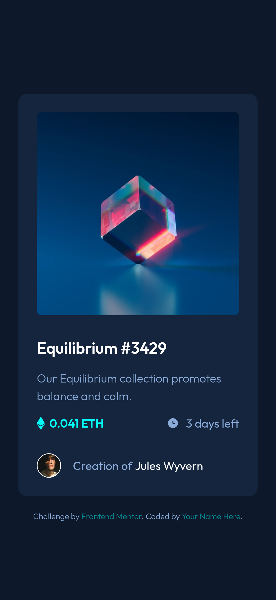
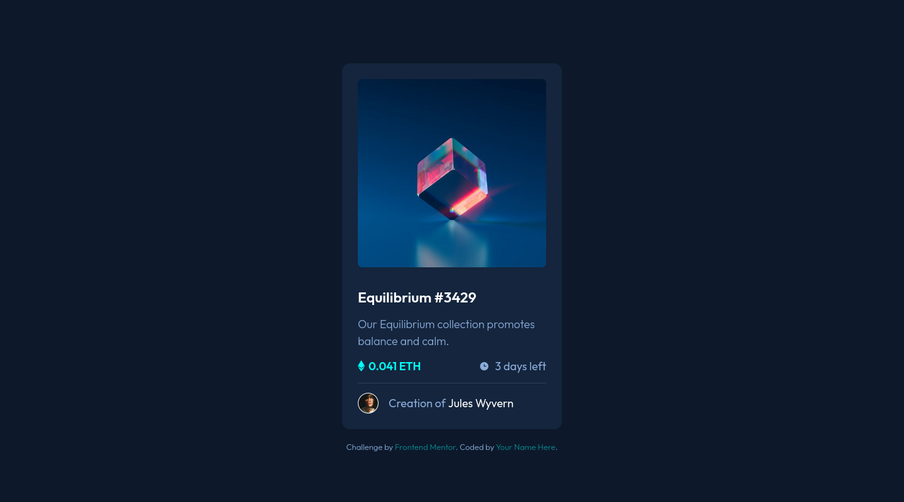

# Frontend Mentor - NFT preview card component solution

This is a solution to the [NFT preview card component challenge on Frontend Mentor](https://www.frontendmentor.io/challenges/nft-preview-card-component-SbdUL_w0U). Frontend Mentor challenges help you improve your coding skills by building realistic projects.

## Table of contents

- [Overview](#overview)
  - [The challenge](#the-challenge)
  - [Screenshot](#screenshot)
  - [Links](#links)
- [My process](#my-process)
  - [Built with](#built-with)
  - [What I learned](#what-i-learned)
  - [Continued development](#continued-development)
- [Author](#author)

## Overview

### The challenge

Users should be able to:

- View the optimal layout depending on their device's screen size
- See hover states for interactive elements

### Screenshot

### Links

- Solution URL: [GitHub](https://github.com/ChrisEski/fem-nft-preview-card)
- Live Site URL: [Add live site URL here](https://your-live-site-url.com)

## My process

### Built with

- Semantic HTML5 markup
- SCSS and BEM naming approach
- Flexbox
- Mobile-first workflow

### What I learned

In this project I took advantage of its simplicity and focused on using semantic HTML elements and structure, as well as paid some attention on the accessibility for the first time.

I also focused on an organized environment, so using SCSS is a must for me (at least for now).

Tried to make the card responsive, even though it might not be necessary given the very subtle changes from mobile to desktop layout, but I wanted to give it a try anyway :)

Last, I had already built this project but decided to refactor it, after taking notes from some users' comments in Frontend Mentor Solutions Section. I believe this gave me some more ideas and solutions.

### Continued development

I will continue focusing on accessibility, as well getting better at making things accessible.

Mobile-first approach seems to be very important, so I will try to focus on that too.

## Author

- Frontend Mentor - [ChrisEski](https://www.frontendmentor.io/profile/ChrisEski)
- Github - [ChrisEski](https://github.com/ChrisEski)
